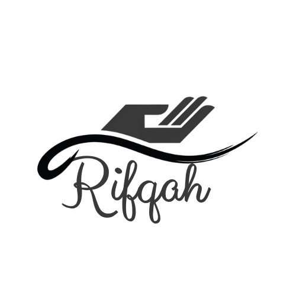
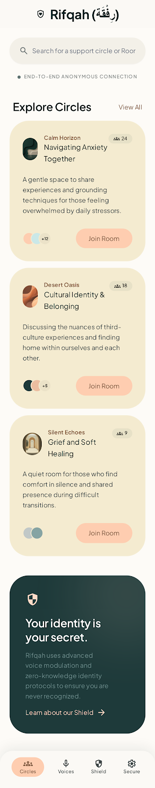
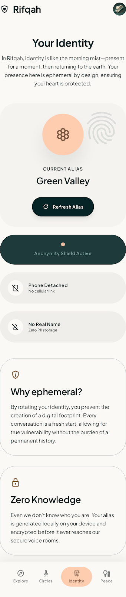
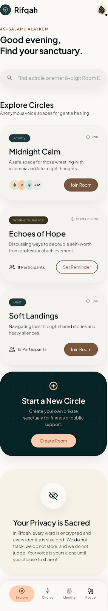
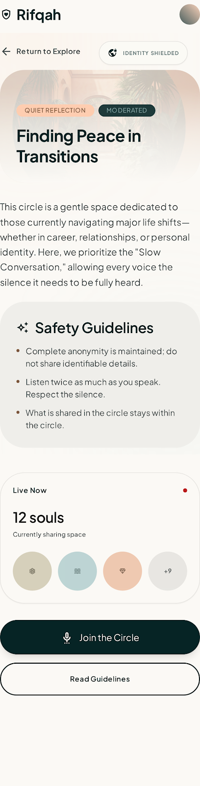
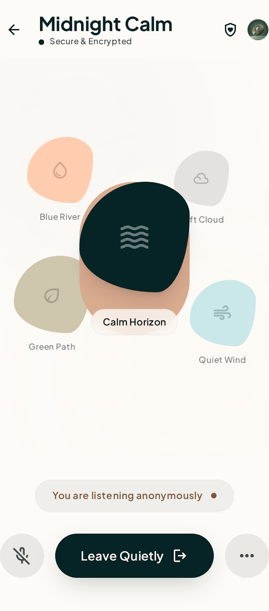

# Rifqah (رفقة)



### Privacy-First Voice Support Platform

**Rifqah** (meaning "Companionship" or "Gentleness" in Arabic) is a secure, decentralized-first peer support platform designed for privacy-conscious communities. By leveraging a centralized SFU for regulatory compliance (NTRA) while pushing heavy media processing to the edge, Rifqah provides a high-security voice environment with negligible infrastructure costs.

---

## 🌍 Mission & Social Impact

Rifqah is built specifically to address the unique social and structural challenges within the **Arab and Egyptian communities**. 

In many parts of our region, seeking mental health or peer support remains stigmatized or legally complex. We are building Rifqah because:
- **Breaking the Stigma:** We provide a culturally safe space where individuals can share experiences without the fear of social repercussion, thanks to our mandatory anonymity.
- **Regulatory Compliance:** Our architecture is designed from the ground up to respect **Egyptian NTRA regulations** by using a centralized signaling and SFU topology, ensuring the platform remains accessible and legal.
- **Privacy as a Right:** In a landscape where digital privacy is often a luxury, Rifqah democratizes high-grade encryption and ephemeral identity, making safe companionship accessible to everyone.

---

## 🏗️ Architecture & Core Principles

The platform is built on three foundational engineering pillars:

1.  **Privacy-First Identity:** Mandatory ephemeral alias masking (e.g., "Blue River") for all participants. Real identities are never exposed in room signaling or media metadata.
2.  **Compliance-Ready SFU:** Utilizes a centralized Selective Forwarding Unit (SFU) topology (LiveKit) acting strictly as a packet reflector. This ensures legal compliance without sacrificing user privacy.
3.  **Edge Compute Efficiency:** Audio slicing, encryption (libsodium), and compression (libopus) are performed natively on client devices. This reduces server CPU overhead to near-zero and ensures data is encrypted before it ever leaves the device.
4.  **Serene Sanctuary UI:** A warm, organic, and gentle design system ("Plus Jakarta Sans" typography, organic shapes, and a palette inspired by Middle Eastern landscapes) intended to promote psychological safety and reduce digital anxiety.

## 🛠️ Tech Stack

-   **Backend:** Go (1.21+), `sqlx`, `chi` router.
-   **Real-time Signaling:** WebSockets with Redis Pub/Sub.
-   **Media Layer:** LiveKit SFU.
-   **Database:** PostgreSQL (State), Redis (Real-time buffers/Queues).
-   **Mobile:** Flutter (iOS/Android) with C++/FFI audio pipeline and a custom Serene Sanctuary component system.
-   **Security:** `bcrypt` (auth), `libsodium` (edge encryption).

## 📂 Project Structure

```text
├── backend/            # Go App Services (Auth, Signaling, State)
├── mobile/             # Flutter Application (Audio Pipeline & UI)
├── infrastructure/     # SQL Schemas, Docker Compose, SFU Configs
└── docs/               # Technical Specification & Design Assets
    ├── DESIGN.md       # "Serene Sanctuary" Design System & Brand Guidelines
    ├── Screens/        # High-fidelity UI design exports
    └── assets/         # Brand logos and iconography
```

## 🚀 Getting Started

### Prerequisites
- Docker & Docker Compose
- Go 1.21+
- Flutter SDK

### 1. Infrastructure Setup
Spin up the database, Redis, and LiveKit SFU:
```bash
docker-compose up -d
```

### 2. Backend Initialization
```bash
cd backend
cp .env.example .env
go run cmd/api/main.go
```

### 3. Mobile Setup
```bash
cd mobile
flutter pub get
# Ensure the device is connected and run
flutter run
```

---

## 🎨 UI & Design

The interface follows the **Serene Sanctuary** design system, focusing on psychological safety, warmth, and "Warm Organicism."

### Design Gallery

| Welcome & Discovery | Identity & Privacy | Discovery Home |
|:---:|:---:|:---:|
|  |  |  |
| *Initial onboarding* | *Anonymity selection* | *Finding active circles* |

| Circle Preview | Voice Circle |
|:---:|:---:|
|  |  |
| *Pre-join details* | *The "Safe Pulse" active* |

## 📅 Roadmap & Progress
- [x] Phase 1: Foundational DB Modeling & Signaling.
- [x] Phase 2: Serene Sanctuary Design System Implementation.
- [x] Phase 3: Centralized SFU Pipeline & "The Ball" State Machine.
- [x] Phase 4: Edge Compute - Client Audio Slicing & Sandboxing.
- [x] Phase 5: Moderator Overrides & Safety Valves.
- [x] Phase 6: Post-Session Grace & Escrow Upload.
- [ ] Phase 7: Professional Clinical Resolution.
